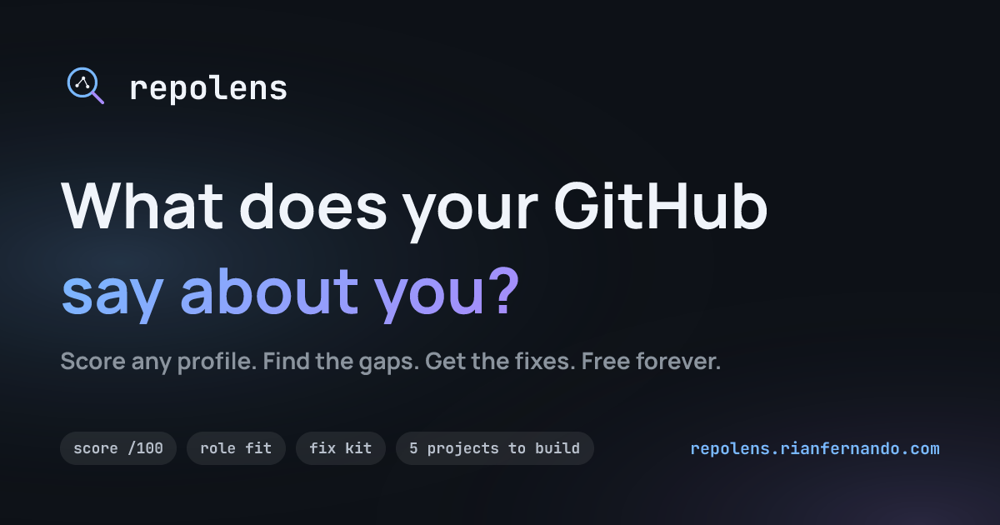
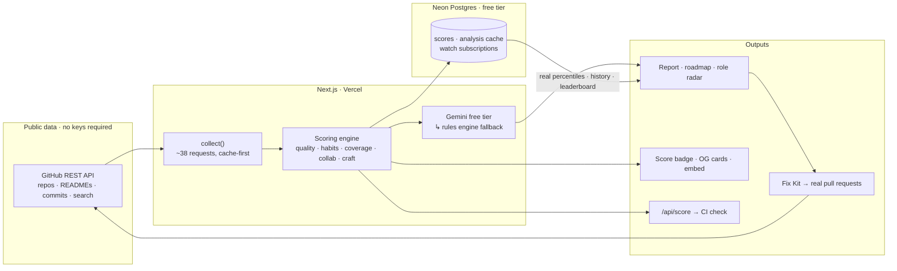

# RepoLens — GitHub Portfolio Analyzer

Scores any public GitHub profile **out of 100 the way a recruiter reads it** — repository
quality, README quality, commit habits, collaboration — and then **doesn't stop at the
diagnosis.** Every deducted point becomes a fix worth a known number of points, and the ones
worth writing for you get written: READMEs, licenses, CI workflows, opened as real pull
requests on your own repos.

[](https://github.com/Rian-Fernando/RepoLens/actions/workflows/ci.yml)
[](https://github.com/Rian-Fernando/RepoLens/actions/workflows/codeql.yml)
[](LICENSE)
[](#the-zero-dollar-path)
[](https://repolens.rianfernando.com)
[](https://repolens.rianfernando.com)

**▶ Live: [repolens.rianfernando.com](https://repolens.rianfernando.com)** · [How scoring works](https://repolens.rianfernando.com/methodology) · [The guide](https://repolens.rianfernando.com/guide) · [Leaderboard](https://repolens.rianfernando.com/leaderboard)



## Why it's different

For a student, your GitHub profile is your resume before anyone opens your resume — and the
people reading it never tell you what they saw. Plenty of tools will show you statistics
about your GitHub. RepoLens is built to **close the loop**: it scores the profile, explains
every point it deducted, ranks the fixes by exactly how many points each one buys back, and
then drafts the boring ones.

The scale is deliberately hard and openly published. Median analyzed profile: **~50**. Only
about one in ten clears 80. Every weight the code uses is written out on the
[methodology page](https://repolens.rianfernando.com/methodology) — no black box, no
mystery number.

## Architecture



Everything degrades instead of breaking. No `GEMINI_API_KEY`? A deterministic rules engine
writes the same report. No `DATABASE_URL`? Percentiles fall back to a calibrated curve. GitHub
quota exhausted? A cached report is served with its age labeled, rather than an error page.

## What it does

- **Scores the profile 0–100** — six weighted components (repository quality 45, recent
  activity 15, portfolio coverage 15, language breadth 10, collaboration 10, commit craft 5),
  computed from real language bytes, full READMEs, up to 100 commits per repo, and search
  across your activity in *other people's* repositories.
- **Targets a role** — retunes scoring emphasis and recommendations for frontend, backend,
  full-stack, data/ML or DevOps, with a radar chart of your coverage against that role.
- **Ranks the fixes by value** — every gap becomes a checklist item labeled with its computed
  score gain ("fix the READMEs on 6 repos: **+13.5**"), saved locally so you can watch the
  number climb.
- **Writes the fixes** — the Fix Kit drafts the missing README, MIT license and CI workflow;
  signed in with GitHub, it opens them as **real pull requests** on repos you own.
- **Matches a job post** — paste a job description and every requirement is mapped to concrete
  evidence in your repositories, or flagged as missing, with a readiness score.
- **Keeps you honest over time** — score history, weekly re-score with an email when it moves,
  an embeddable score badge, and a `/api/score` endpoint plus workflow that fails CI when your
  portfolio quality drops.
- **Scales to a room** — rank a whole GitHub organization or a pasted list of usernames, with
  CSV export, for bootcamps, clubs and hackathon judging.
- **Roasts you, optionally** — the same analysis, delivered by a comedian instead of a coach.
  The resume bullets stay serious.

## The zero-dollar path

| Layer | How it's free | Degrades to |
|---|---|---|
| Hosting | Vercel hobby tier | — |
| Profile data | [GitHub REST API](https://docs.github.com/rest) — 60 req/hour anonymous, 5,000 with any token | cached report, age labeled |
| Written analysis | [Google Gemini](https://ai.google.dev) free tier (~1,500 req/day, no card) | built-in rules engine |
| Benchmarks & history | [Neon](https://neon.tech) Postgres free tier | estimated percentile curve |
| Emails (optional) | [Resend](https://resend.com) free tier | feature hides itself |
| Monitoring (optional) | Vercel Analytics · Speed Insights · Sentry free tiers | inert when unset |

There is no paid plan, no account, and no key you must supply to use it. The app **never
breaks and never bills anyone.**

## Run it

```bash
npm install
npm run dev        # http://localhost:3000 — works immediately, rules-engine mode
```

For AI-written analysis (still free), copy `.env.local.example` to `.env.local` and add a
`GEMINI_API_KEY` from [aistudio.google.com/apikey](https://aistudio.google.com/apikey). Every
other variable is optional and documented in that file — the app is designed to run with none
of them set.

## Project structure

```
app/
  page.tsx                 landing, dashboard, and the story sections
  u/[username]/            shareable report + dynamic OG score card
  compare/ org/ match/     head-to-head, cohort ranking, job matcher
  guide/ methodology/      recruiter-readiness guide, published scoring weights
  action/                  CI score-check workflow docs
  api/analyze              GitHub crawl + scoring, cache-first
  api/suggest              Gemini structured output → rules fallback
  api/fix-readme fix-pr    AI drafts → real pull requests (GitHub OAuth)
  api/score/[username]     public JSON score API (drives the CI check)
  api/badge api/embed      SVG score badge, iframe widget
  api/cron/watch           weekly re-score + email when a score moves
  llms.txt robots sitemap  discovery surface for search + answer engines
lib/
  github.ts                REST client, ~38 requests per analysis
  analyze.ts               the scoring engine (repos, READMEs, habits, gaps)
  roadmap.ts               gaps → checklist items with computed point gains
  suggest-fallback.ts      the $0 rules engine
  gemini.ts                minimal Gemini REST client, no SDK
  db.ts                    Neon: scores, analysis cache, watch subscriptions
components/                charts, fix kit, role radar, starfield, motion
design/                    brand handoff — logo, palette, type scale
```

## Docs

- [Methodology](https://repolens.rianfernando.com/methodology) — every scoring weight, tier
  thresholds, percentile maths, and what RepoLens deliberately cannot see
- [The guide](https://repolens.rianfernando.com/guide) — what recruiters actually look for
- [CHANGELOG.md](CHANGELOG.md) · [NOTICE.md](NOTICE.md)

## License

[MIT](LICENSE) © Rian Fernando. Independent project — **not affiliated with GitHub.** A score
is a heuristic read of public metadata, not a judgement of you or of your code.
